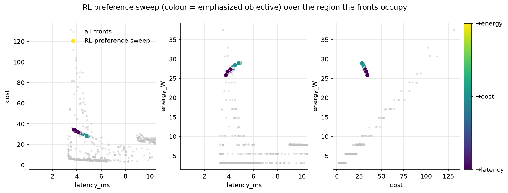
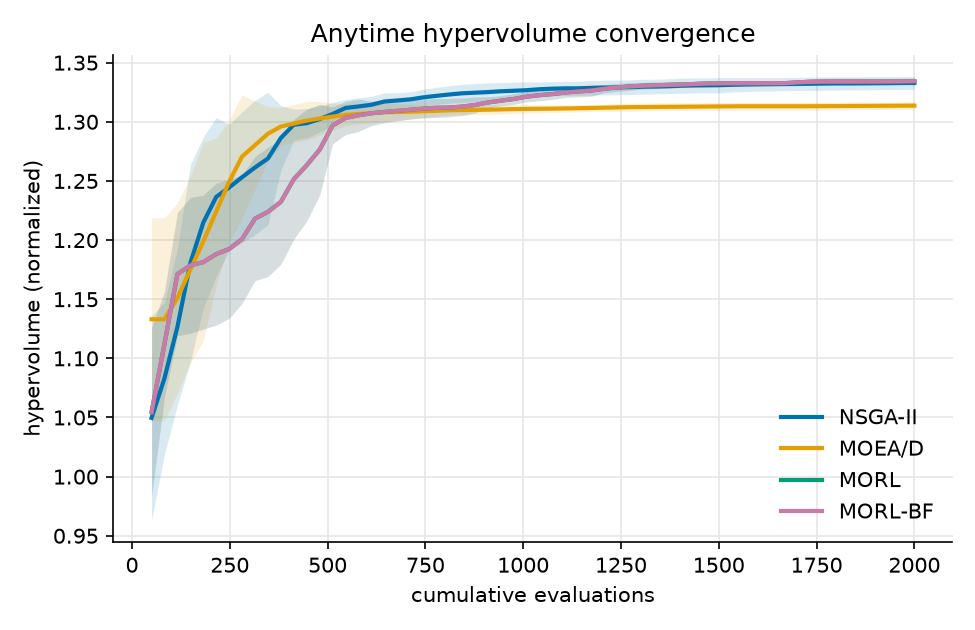
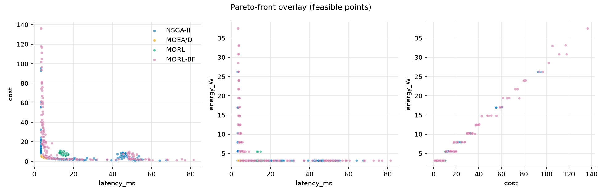
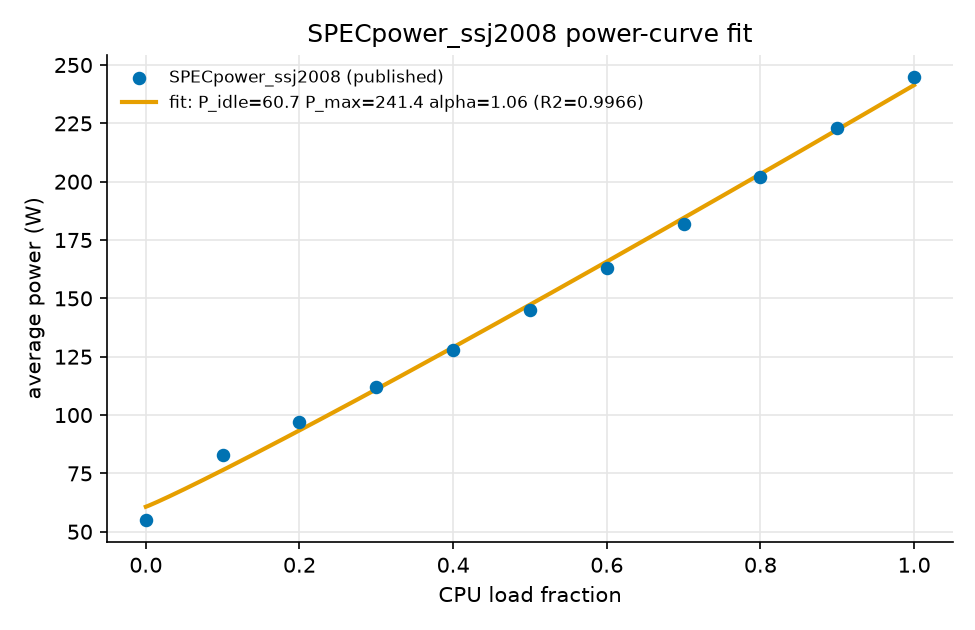
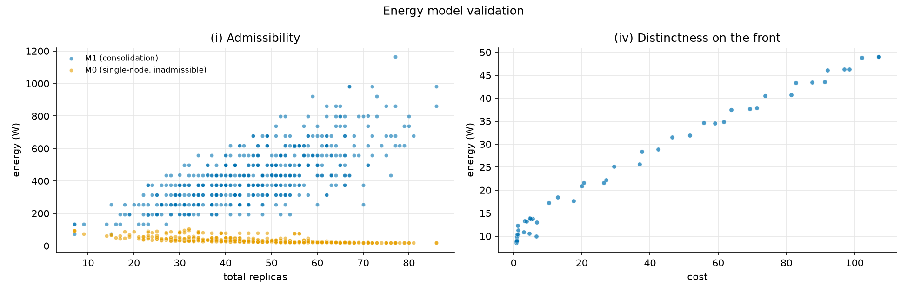

# Comparison protocol

This document tracks the benchmark study built on top of the instance
defined in `SPEC.md`: which algorithms are compared, on what metrics,
under what budget. Moved here from the old `SPEC.md` sections 4 and 5
when `SPEC.md` was reformatted to the ROAR-NET problem-statement
template, which covers the instance definition only.

## Protocol

- Budget: 2000 evaluations at population 50, scaled up from the 500/pop
  20 floor once the timing study confirmed the target budget is
  affordable.
- Algorithms: NSGA-II, MOEA/D, and the RL baseline, all scored on the
  same oracle for a fair objective-space comparison.
- Metrics: anytime hypervolume against cumulative evaluations, final
  GD+ and IGD+, and the Wilcoxon signed-rank test across 10 independent
  seeds.
- Analysis: the relation between the RL scalarization weights and the
  MOEA/D reference directions, and the spatial relation of the RL and
  evolutionary fronts.

An early NSGA-II/MOEA-D check at both budgets, held-out protocol (train
days 0/1/2, test day 3, base_seed 42, K=5, n=10 seeds): at the 500-eval
floor the two are statistically tied (HV 1.3131 vs 1.3066, Wilcoxon
p=0.160). At the 2000-eval target they separate, NSGA-II ahead (HV
1.3235 vs 1.3045, p=0.0020). The RL baseline is not in this check yet;
that three-way comparison lands with the full study.

## RL scalarization weights vs MOEA/D reference directions

The MORL baseline (`experiments/run_morl.py`) does not train against four
fixed named weights (perf/cost/energy/balanced). Instead its
preference-conditioned policy sweeps the exact same das-dennis reference
directions MOEA/D decomposes with (`experiments/run_moead.py`), so the
two algorithms search under the identical direction set by construction.
This is a more direct answer to the coverage question than four
hand-picked corners would give.

`experiments/analyze_fronts.py` queries the trained policy greedily
(`policy.mean(w)`) at every direction in the set and checks whether each
direction's emphasized objective is actually the one it minimizes.

**Bug found and fixed while closing issue #16.** This script's own
`--partitions` default was 6, but `run_moead.py`'s default is 12. So
the "same directions MOEA/D decomposes with" claim was not true for a
default-args run. The 28-direction numbers below are superseded, kept
for context, not deleted. The default is now 12, matching
`run_moead.py`.

One representative run (seed 1, 500-eval budget, das-dennis
partitions=12, 91 directions):

- Corner specialization: the pure latency and cost directions correctly
  minimize their own objective. The pure energy direction does not; its
  greedy config's lowest energy is instead achieved by the
  latency-emphasizing direction. Same result as the old 28-direction
  run, so this was not the partitions bug.
- Preference consistency (the emphasized objective is the smallest
  normalized one achieved): 0.52, 47 of 91 directions get what they
  asked for. Not directly comparable to the old 0.64, since the
  direction set itself is different (91 directions instead of 28).
- All 91 greedy configs land below the 5000 ms timeout, so none of this
  is explained by infeasible preferences.
- Energy is still the objective that specializes least. A plausible
  reason, not yet confirmed: the energy model's own constants are still
  placeholder (see the calibration open item below), so its signal may
  be weaker or noisier than latency's and cost's for the policy to
  steer against.

## Spatial relationship of the fronts

Where does each algorithm's front sit relative to the others in
objective space? `experiments/analyze_fronts.py` answers this with
two-set coverage (Zitzler's C-metric): C(A, B) is the fraction of B's
front that A's front weakly dominates. Computed over the 10 shared
seeds in `results/` (floor budget, 500 evals), the same data behind
the floor-budget row of the full comparison table above. MORL is the
greedy-policy front, MORL-BF is the best-found front (see the full
comparison section for what these two mean).

|         | NSGA-II | MOEA/D | MORL | MORL-BF |
|---|---|---|---|---|
| NSGA-II | -- | 0.230 | 1.000 | 0.889 |
| MOEA/D | 0.122 | -- | 1.000 | 0.588 |
| MORL | 0.000 | 0.000 | -- | 0.000 |
| MORL-BF | 0.000 | 0.000 | 1.000 | -- |

Read row over column: NSGA-II dominates 23% of MOEA/D's points, and
MOEA/D dominates only 12% of NSGA-II's. This is not symmetric. NSGA-II
covers more of MOEA/D's front than the reverse, in the same direction
as NSGA-II's small edge in hypervolume above.

MORL's greedy front is dominated by everything and dominates nothing.
This matches its weak hypervolume score (1.05 against about 1.31 for
the others). MORL-BF tells a different story. NSGA-II dominates 89% of
MORL-BF's points and MOEA/D dominates 59% of them, yet MORL-BF's own
hypervolume (1.3149) ties NSGA-II's (1.3131). Read together, this says
MORL-BF's points sit close to NSGA-II's front, only just behind it
point for point, rather than off in a weaker region of the space.
MORL's weak result comes from the greedy readout, not from the RL
approach as a whole.

The figure below shows the RL policy's preference sweep, colored by
which objective each direction emphasizes, plotted over the region all
four fronts occupy.

## Metrics aggregation and MORL baseline scoring

`experiments/aggregate.py` reads the per-seed `.npz` runs written by each
runner and reports anytime hypervolume against cumulative evaluations, final
hypervolume, GD+, and IGD+ against a shared reference set, and Wilcoxon
signed-rank tests between algorithms, plus a convergence figure and a
Pareto-front overlay.

MORL's own score on the offline oracle, 5 seeds at the target budget (2000
evals, archive 50, K=5): HV 1.2468 +/- 0.0086, IGD+ 0.0111 +/- 0.0035, GD+
0.0068 +/- 0.0042. Single-algorithm numbers only, since no NSGA-II/MOEA-D runs
share this directory yet; the Wilcoxon test needs a second algorithm's runs to
compare against. The full three-way NSGA-II/MOEA-D/MORL comparison is a
separate, larger 10-seed run, tracked as its own item below.

Anytime hypervolume convergence and the Pareto-front overlay for this run:

## Full comparison: 10 seeds x {NSGA-II, MOEA/D, MORL}

Same held-out protocol as above (train days 0/1/2, test day 3, base_seed
42, K=5, n=10 seeds), run at both budgets. MORL reports two numbers:
"greedy" is the trained policy's actual readout, the deployable score.
"best-found" is the best point MORL saw anywhere during training, a
diagnostic upper bound, not something the policy can reliably reproduce
on its own.

**Floor budget (500 evals, pop 20), `docs/data/comparison_floor.csv`:**

| algo | HV (mean) | IGD+ | GD+ |
|---|---|---|---|
| NSGA-II | 1.3131 | 0.0025 | 0.0069 |
| MOEA/D | 1.3066 | 0.0043 | 0.0001 |
| MORL best-found | 1.3149 | 0.0058 | 0.1442 |
| MORL greedy | 1.0479 | 0.1588 | 0.0033 |

Wilcoxon: NSGA-II vs MOEA/D p=0.160, NSGA-II vs MORL-BF p=0.492, MOEA/D
vs MORL-BF p=0.160 (all tied). MORL greedy trails everything, p=0.0020
against each.

**Target budget (2000 evals, pop 50), `docs/data/comparison_2000.csv`:**
this is the proposal's actual stated budget and is the number that
should anchor any paper or STSM-report claim about the raw held-out
ranking.

| algo | HV (mean +/- std) | IGD+ | GD+ |
|---|---|---|---|
| NSGA-II | 1.3235 +/- 0.0053 | 0.0008 +/- 0.0006 | 0.0056 +/- 0.0105 |
| MOEA/D | 1.3045 +/- 0.0031 | 0.0037 +/- 0.0009 | 0.0000 +/- 0.0000 |
| MORL best-found | 1.3250 +/- 0.0025 | 0.0009 +/- 0.0003 | 0.0969 +/- 0.0493 |
| MORL greedy | 1.2752 +/- 0.0052 | 0.0197 +/- 0.0039 | 0.0004 +/- 0.0003 |

Wilcoxon: NSGA-II vs MOEA/D p=0.0020, NSGA-II vs MORL-BF p=0.6953
(tied), MOEA/D vs MORL-BF p=0.0020, MORL greedy below NSGA-II and
MOEA/D at p=0.0020 each.

**More budget does not just sharpen the floor result, it changes it.**
At the floor, NSGA-II, MOEA/D, and MORL best-found were all
statistically tied. At the target budget, NSGA-II and MORL best-found
stay tied with each other, but MOEA/D separates below both,
significantly. This should be read as "MOEA/D was not distinguishable
from the other two at 500 evals, and now is," not as a general claim
that MOEA/D is the weaker algorithm. MORL greedy also improved a lot
with the larger training budget, from HV 1.0479 to 1.2752, though it
still trails the top group.

## Energy model validation (offline)

Two checks that need no live cluster, both against the calibrated oracle.

**Power curve.** The node power curve `P(u) = P_idle + (P_max-P_idle)*u^alpha`
is fit against SPECpower_ssj2008, a published, standardized benchmark that
reports measured average watts at 11 load levels for a real server. This
grounds the curve's form and parameters in measured hardware without needing
a cluster of our own: P_idle=60.7 W, P_max=241.4 W, alpha=1.061, R2=0.9966.

**Admissibility and distinctness.** Two more checks against a 6000-eval
NSGA-II front and a 500-config random pool, at the fitted power curve above.
(i) Admissibility: energy should rise with the number of running replicas
under a consolidation-aware model, and fall under a naive single-node model
that ignores packing. Spearman(sum replicas, energy): M0 (single-node)
-0.846, M1 (consolidation) +0.697, confirming M1 is the admissible model. (iv)
Distinctness: on the 50-point front, cost and energy are strongly correlated
(Spearman +0.986) but not identical, so energy is not a redundant copy of
cost. 20% of front points are admitted only by the energy axis, and 1 of 5
latency-ordered slices shows a real cost/energy trade (Spearman < 0.5).

## Open items

- [ ] Calibrate `topology.py` constants (`service_demand_s`, working
      set, `node_cpu_capacity_cores`, energy parameters) to a real
      cluster.
- [x] Confirm the multi-tier topology and call graph (`SPEC.md`,
      Detailed description).
- [x] Add the RL baseline on the offline oracle (`experiments/run_morl.py`).
- [x] Build the hypervolume, GD+/IGD+, and Wilcoxon aggregation with
      anytime-convergence plots.
- [x] Run the full 10-seed x {NSGA-II, MOEA/D, MORL} comparison.
- [ ] Confirm the final fronts on a real cluster.
