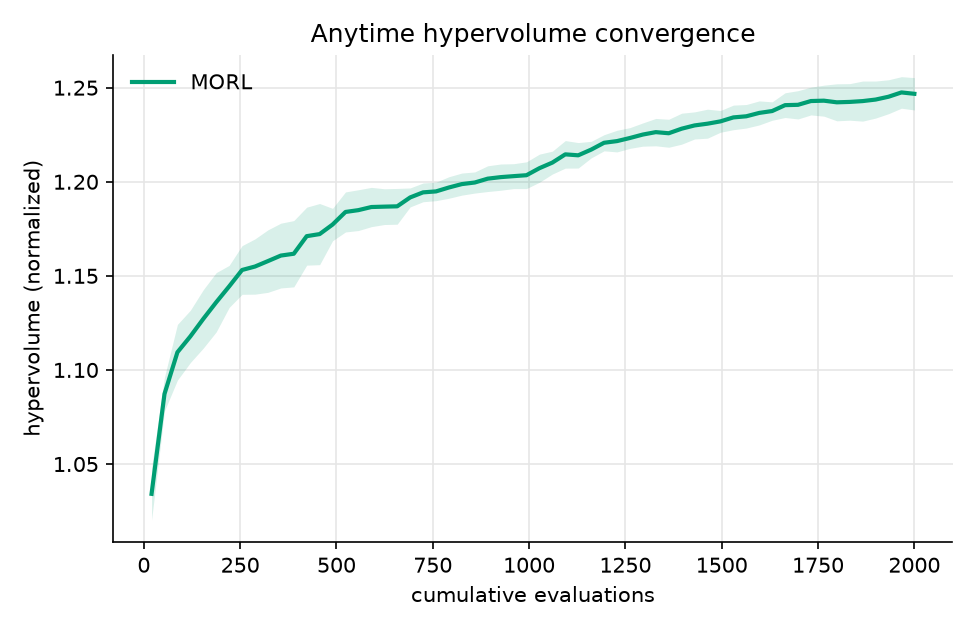
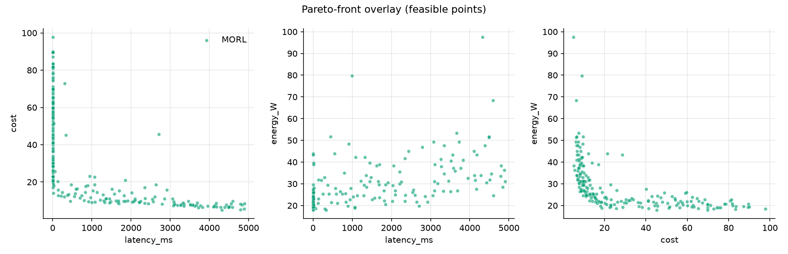

# Comparison protocol

This document tracks the benchmark study built on top of the instance
defined in `SPEC.md`: which algorithms are compared, on what metrics,
under what budget. Moved here from the old `SPEC.md` sections 4 and 5
when `SPEC.md` was reformatted to the ROAR-NET problem-statement
template, which covers the instance definition only.

## Protocol

- Budget: 2000 evaluations at population 50, scaled up from the 500/pop
  20 floor once the timing study confirmed the target budget is
  affordable.
- Algorithms: NSGA-II, MOEA/D, and the RL baseline, all scored on the
  same oracle for a fair objective-space comparison.
- Metrics: anytime hypervolume against cumulative evaluations, final
  GD+ and IGD+, and the Wilcoxon signed-rank test across 10 independent
  seeds.
- Analysis: the relation between the RL scalarization weights and the
  MOEA/D reference directions, and the spatial relation of the RL and
  evolutionary fronts.

An early NSGA-II/MOEA-D check at both budgets, held-out protocol (train
days 0/1/2, test day 3, base_seed 42, K=5, n=10 seeds): at the 500-eval
floor the two are statistically tied (HV 1.3131 vs 1.3066, Wilcoxon
p=0.160). At the 2000-eval target they separate, NSGA-II ahead (HV
1.3235 vs 1.3045, p=0.0020). The RL baseline is not in this check yet;
that three-way comparison lands with the full study.

## RL scalarization weights vs MOEA/D reference directions

The MORL baseline (`experiments/run_morl.py`) does not train against four
fixed named weights (perf/cost/energy/balanced). Instead its
preference-conditioned policy sweeps the exact same das-dennis reference
directions MOEA/D decomposes with (`experiments/run_moead.py`), so the
two algorithms search under the identical direction set by construction.
This is a more direct answer to the coverage question than four
hand-picked corners would give.

`experiments/analyze_fronts.py` queries the trained policy greedily
(`policy.mean(w)`) at every direction in the set and checks whether each
direction's emphasized objective is actually the one it minimizes. One
representative run (seed 1, 500-eval budget, das-dennis partitions=6, 28
directions):

- Corner specialization: the pure latency and cost directions correctly
  minimize their own objective. The pure energy direction does not; its
  greedy config's lowest energy is instead achieved by the
  latency-emphasizing direction.
- Preference consistency (the emphasized objective is the smallest
  normalized one achieved): 0.64, 18 of 28 directions get what they
  asked for.
- All 28 greedy configs land below the 5000 ms timeout, so none of this
  is explained by infeasible preferences.
- Energy is the objective that specializes least. A plausible reason,
  not yet confirmed: the energy model's own constants are still
  placeholder (see the calibration open item below), so its signal may
  be weaker or noisier than latency's and cost's for the policy to
  steer against.

Figure: `results/fig_weights.png` (generated by `analyze_fronts.py`,
not committed, matching how every other run artifact under `results/`
is handled).

Bonus, not yet a closed analysis: `analyze_fronts.py` also computes the
two-set coverage matrix between all three algorithms' fronts, the
spatial-relation question tracked separately. One seed's worth landed
as a side effect of building this script; the full multi-seed version
is still open.

## Metrics aggregation and MORL baseline scoring

`experiments/aggregate.py` reads the per-seed `.npz` runs written by each
runner and reports anytime hypervolume against cumulative evaluations, final
hypervolume, GD+, and IGD+ against a shared reference set, and Wilcoxon
signed-rank tests between algorithms, plus a convergence figure and a
Pareto-front overlay.

MORL's own score on the offline oracle, 5 seeds at the target budget (2000
evals, archive 50, K=5): HV 1.2468 +/- 0.0086, IGD+ 0.0111 +/- 0.0035, GD+
0.0068 +/- 0.0042. Single-algorithm numbers only, since no NSGA-II/MOEA-D runs
share this directory yet; the Wilcoxon test needs a second algorithm's runs to
compare against. The full three-way NSGA-II/MOEA-D/MORL comparison is a
separate, larger 10-seed run, tracked as its own item below.

Anytime hypervolume convergence and the Pareto-front overlay for this run:

## Open items

- [ ] Calibrate `topology.py` constants (`service_demand_s`, working
      set, `node_cpu_capacity_cores`, energy parameters) to a real
      cluster.
- [x] Confirm the multi-tier topology and call graph (`SPEC.md`,
      Detailed description).
- [x] Add the RL baseline on the offline oracle (`experiments/run_morl.py`).
- [x] Build the hypervolume, GD+/IGD+, and Wilcoxon aggregation with
      anytime-convergence plots.
- [ ] Run the full 10-seed x {NSGA-II, MOEA/D, MORL} comparison.
- [ ] Confirm the final fronts on a real cluster.
